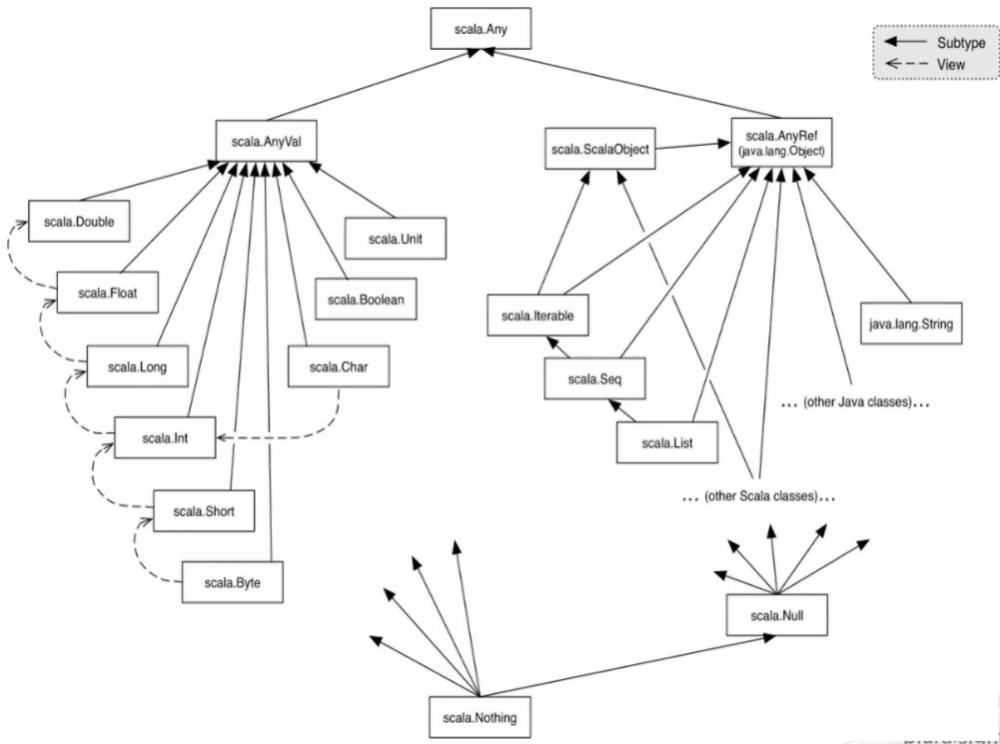
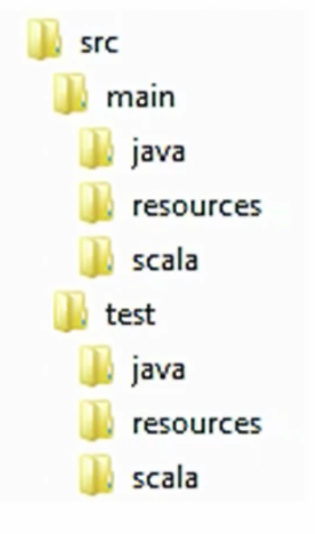

<!-- START doctoc generated TOC please keep comment here to allow auto update -->
<!-- DON'T EDIT THIS SECTION, INSTEAD RE-RUN doctoc TO UPDATE -->
**Table of Contents**  *generated with [DocToc](https://github.com/thlorenz/doctoc)*

- [Scala: Getting Started](#scala-getting-started)
  - [Intro](#intro)
    - [Install](#install)
    - [REPL](#repl)
  - [Building Blocks](#building-blocks)
    - [Simple Build Tool (sbt)](#simple-build-tool-sbt)
    - [ScalaTest](#scalatest)

<!-- END doctoc generated TOC please keep comment here to allow auto update -->

# Scala: Getting Started

> My notes from Pluralsight [course](https://app.pluralsight.com/library/courses/scala-getting-started/table-of-contents)

## Intro

### Install

```shell
$ brew update
$ brew install scala
$ brew install sbt
```

### REPL

Just type `scala` in terminal, then to print something to screen:

```scala
scala> println("Hello World")
Hello World
```

Declare a value variable with the name `hello`, type of `String`, and assign it the string "Hello World".
Note that variable type follows the variable name. REPL responds with information about newly created variable,
including name of variable, the variable type, and what that variable is equal to, by evaluating its `toString` method.

```scala
scala> val hello : String  = "Hello World"
hello: String = Hello World

scala> println(hello)
Hello World
```

Can achieve the above with even less boilerplate using Scala's _type inference_.

```scala
scala> val helloInferred = "hello type inference"
helloInferred: String = hello type inference

scala> val myNum = 5
myNum: Int = 5

scala> val MyDbl = 5.5
MyDbl: Double = 5.5
```

__Unified Type System__



All values in Scala are objects, inheriting from `scala.Any`. From there, it splits between value objects `scala.AnyVal` and reference objects `scala.AnyRef`.

wrt inference, Scala tries to find greatest common factor of all items being returned or assigned. For example, a method that returns a `java.lang.String` in a `scala.List`,  then the greatest common factor between those two types is `scala.AnyRef`, which is what the compiler will infer.

If you know the return type in advance, can explicitly annotate it in the code.

Further code simplification, note no semicolon, only needed when performing 2 or more evaluations on the same line of code, otherwise compiler uses whitespace or code block positioning to determine end of expression:

```scala
scala> "Hello REPL"
res2: String = Hello REPL
```

In the above case, the compiler has taken the value "Hello REPL" and automatically assigned it to a system generated value variable `res2`. This is just a nicety for testing code in the REPL.

__Variables__

Note the term _value variable_, not simply _variable_. Will get an error if try to re-assign a value variable such as `hello` from earlier example.

```scala
hello = "Hello"
<console>:12: error: reassignment to val
       hello = "Hello"
             ^
```

Once set, a value variable is _immutable_ and cannot be changed.

For mutable variables, use keyword `var`:

```scala
scala> var mutableVar = 0
mutableVar: Int = 0

scala> var mutableVar = 1
mutableVar: Int = 1
```

However, Scala is _preferentially functional_ and so prefers immutability. Default should be to use `val` over `var`.

__Methods__

Methods are created using `def` keyword. General form of method definition is `def` followed by method name,
then comma separated list of input parameters in parenthesis,
then a colon and return type, which can be ommitted if you want compiler to infer it,
finally `=` followed by method logic.

If code is a simple expression, brackets can be ommitted, otherwise, wrap logic in brackets.

Example with return type inferred, note intentional typo of returning string "0" instead of int 0.
Compiler will accept this and infer Any type <- __danger of type inference__

```scala
scala>def boolToInt(value : Boolean) = if(value) 1 else "0"
boolToInt: (value: Boolean)Any
```

Example with return type explicitly annotated, note had to fix string/int 0 typo otherwise compiler would error on unexpected return type:

```scala
scala> def boolToInt2(value : Boolean): Int = if(value) 1 else 0
boolToInt2: (value: Boolean)Int
```

Note in above method bodies, there's no explicit `return` statement. In Scala, all code is _expression based_. Meaning everything returns something, therefore last item in code evaluation automatically becomes return value.

With `if`, each branch returns a value. If/else in Scala is not standard control flow, but rather an expression that returns final output of its evaluation.

Even no-op methods like `println` have a return type.

`:q` to exit REPL.

## Building Blocks

Over the course, will be building a File Searcher app, requirements:

* Find all files that match a given filter at a given location
  * Only matchfiles
  * Use current location if given location is ommitted
  * Search sub-folders from given location
* Further filter files using a content filter
* Return number of matches found in file
* Allow filters to be regular expressions
* Write results to a given file

### Simple Build Tool (sbt)

* Built-in defaults
  * compile
  * test
  * run

No configuration needed, given that default project structure is followed (based on maven):



Can also run `sbt` interactively, just enter it into a terminal at project root. It will automatically compile any source it finds, even in project root (although not recommended to place source in root), [example](projects/hello/HelloSbt.scala).

`console` task opens a REPL with project classpath already set.

Can instantiate project class at REPL, for example:

```scala
new Main
res0: Main = Main@27778cce
```

It works with no parens, recommendation is to only use no parens when action has no side effect.
For example `sayHi` method does have side effect of writing to console, so it would be invoked with parens: `res0.sayHi()`.

More on [Scala style](http://docs.scala-lang.org/style/).

To exit sbt interactive mode, type `exit`.

To setup a proper project, create a [build.sbt](projects/filesearcher/build.sbt) file in project root.

Note that blank line acts as delimiter between settings.

`name` and `version` are the minimal settings needed to package project into a jar.

If don't scpecify `scalaVersion`, then it will use whatever version sbt was built against, better to specify.

Create a `project` directory, which will contain [build.properties](projects/filesearcher/build.properties) and [plugins.sbt](projects/filesearcher/project/plugins.sbt)

SBT uses [Apachy Ivy](http://ant.apache.org/ivy/ ) for dependency management. First value is group id, second is artifact id, and third is revision:

```scala
addSbtPlugin("com.typesafe.sbteclipse" % "sbteclipse-plugin" % "2.4.0")
```

After all the setup is in place, open `build.sbt` in IntelliJ (assuming Language Scala and SBT plugins are installed), it will create this project structure:

```
src
├── main
│   ├── java
│   ├── scala
│   └── scala-2.11
└── test
    ├── java
    ├── scala
    └── scala-2.11
```

Right-click on `src/main/scala` and select "Create new Worksheet", name it [Testbed.sc](projects/filesearcher/src/main/scala/Testbed.sc).

A worksheet provides REPL-like feedback within the IDE.

### ScalaTest

Will use unit tests to codify the app requirements. Tests will be written in [ScalaTest](http://www.scalatest.org/) and run with [JUnit Test Runner](http://junit.org/junit4/). To use these, add `libraryDependencies` to [build.sbt](projects/filesearcher/build.sbt).

Use 4th argument to specify dependency is only needed for the "test" configuration.

```scala
libraryDependencies += "org.scalatest" % "scalatest_2.11" % "2.2.6" % "test"
libraryDependencies += "com.novocode" % "junit-interface" % "0.11" % "test"
```
